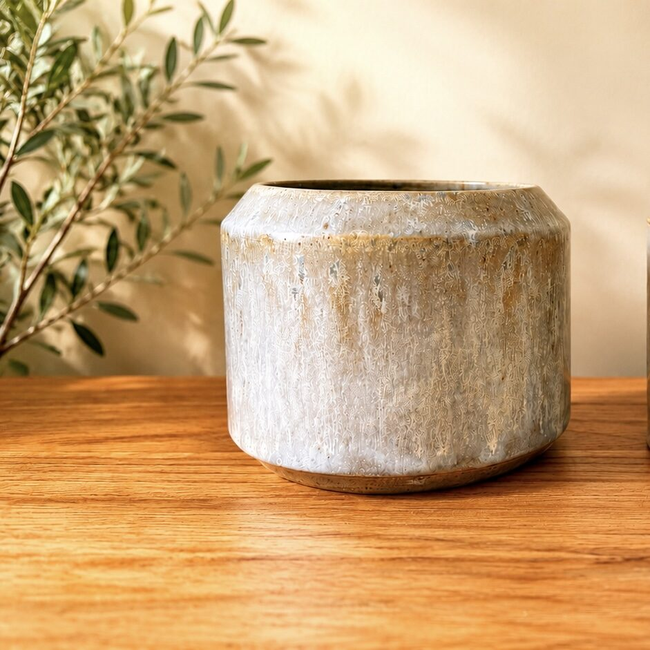

# Documentation — Alex le Potier

Guide complet pour modifier et administrer le site [alex.lepotier.ovh](https://alex.lepotier.ovh).

---

## Table des matières

1. [Vue d'ensemble](#vue-densemble)
2. [Modifier le contenu](#modifier-le-contenu)
3. [Gérer la galerie (images)](#gérer-la-galerie-images)
4. [Modifier les informations de contact](#modifier-les-informations-de-contact)
5. [Modifier la FAQ](#modifier-la-faq)
6. [Modifier la page À propos](#modifier-la-page-à-propos)
7. [Modifier le header/footer (navigation)](#modifier-le-headerfooter)
8. [Personnaliser le design (couleurs, polices)](#personnaliser-le-design)
9. [Administration du site](#administration-du-site)
10. [SEO et référencement](#seo-et-référencement)
11. [Dépannage](#dépannage)

---

## Vue d'ensemble

Le site est un site **statique** (HTML/CSS/JS pur) hébergé sur **GitHub Pages**. Il n'y a pas de base de données ni de CMS.

**Pour modifier le site :** on édite les fichiers directement, puis on pousse les changements sur GitHub. Le site se met à jour automatiquement en quelques minutes.

### Structure des fichiers

```
index.html            → Page d'accueil (hero + démarche + commandes)
pieces.html           → Galerie des pièces (grille + lightbox)
apropos.html          → Page À propos (parcours, matière, geste)
faq.html              → Foire aux questions (10 Q/R, toujours visibles)
contact.html          → Formulaire de contact (Formspree) + carte
fds.html              → Fiches de données de sécurité (matières premières)
emaux.html            → Page émaux/glaçures (avec sa propre CSS)
mentions-legales.html → Mentions légales
cgv.html              → Conditions générales de vente
404.html              → Page d'erreur 404 personnalisée
en/                   → Version anglaise (7 pages)
css/style.css         → Styles principaux (~1350 lignes)
css/emaux.css         → Styles spécifiques à la page émaux
js/main.js            → Menu mobile, lightbox, animations scroll
images/               → Toutes les images (JPG + WebP)
fds/                  → PDFs des fiches de données de sécurité
CNAME                 → Configuration du domaine personnalisé
robots.txt            → Règles d'indexation moteurs de recherche
sitemap.xml           → Plan du site pour le SEO
```

---

## Modifier le contenu

### Page d'accueil (`index.html`)

| Élément | Où le trouver | Ce qu'il faut modifier |
|---------|---------------|----------------------|
| Titre principal | `.hero-content` > `<h1>` | Le texte "Alex le Potier" |
| Phrase d'accroche | `.hero-content` > `<p>` | "Ce qui est fait lentement reste." |
| Étiquette hero | `.hero-tag` | "Poteries en grès tournées à la main..." |
| Bouton CTA | Lien `.cta` dans le hero | Texte et URL du bouton |
| Section démarche | `.demarche` | Titre H2, paragraphes, arguments |
| Les 3 arguments | `.argument` (x3) | Titre `<h3>` et texte `<p>` de chaque |
| Section commandes | `.commandes` | Texte sur les commandes personnalisées |
| Image photo-piece | `.photo-piece` > `<picture>` | Remplacer `shelf.jpg`/`shelf.webp` |

### Modifier un texte

1. Ouvrir le fichier HTML concerné
2. Rechercher le texte à modifier
3. Le remplacer par le nouveau texte
4. Sauvegarder et pousser sur GitHub

---

## Gérer la galerie (images)

### Ajouter une image à la galerie

**Étape 1 — Préparer l'image**

```bash
# Optimiser l'image (qualité 85%, taille raisonnable)
convert source.jpg -quality 85 -resize "1200x1200>" images/27.jpg

# Créer la version WebP (plus légère)
cwebp -q 80 images/27.jpg -o images/27.webp

# Vérifier les dimensions
identify images/27.jpg
```

Objectifs :
- Poids < 500 Ko par image
- Largeur max ~1200px suffit

**Étape 2 — Ajouter dans `pieces.html`**

Insérer ce bloc dans `<div class="gallery-grid">` à l'endroit voulu :

```html
<a href="images/27.jpg" class="gallery-item" data-lightbox>
  <picture>
    <source srcset="images/27.webp" type="image/webp">
    
  </picture>
</a>
```

**Important :**
- Le `alt` doit décrire la pièce en français (ex: "Bol en grès tourné, émail cendré")
- Adapter `width` et `height` aux dimensions réelles de l'image
- Chaque 3ème image de la grille s'affiche en pleine largeur automatiquement (via CSS `nth-child(3n)`)

**Étape 3 — Mettre à jour la version anglaise** (si elle existe)

Faire la même chose dans `en/pieces.html` avec un `alt` en anglais.

### Supprimer une image

1. Supprimer le bloc `<a class="gallery-item">...</a>` correspondant dans `pieces.html`
2. Optionnel : supprimer les fichiers `.jpg` et `.webp` du dossier `images/`

### Réorganiser les images

Changer l'ordre des blocs `<a class="gallery-item">` dans le HTML. L'image en 1ère position apparaît en haut à gauche.

### Changer l'image du hero (accueil)

Dans `index.html`, chercher la section `.hero` et modifier l'image de fond dans `css/style.css` :

```css
.hero {
  background-image: url('../images/25.jpg');
}
```

Remplacer `25.jpg` par la nouvelle image (idéalement 1920×1080, < 250 Ko).

---

## Modifier les informations de contact

Fichier : `contact.html`

| Information | Où la trouver |
|-------------|---------------|
| Localisation | `.contact-info` > premier `<p>` |
| Instagram | Lien `@alexlepotier` dans `.contact-social` |
| SIRET | `.contact-siret` |
| Carte OpenStreetMap | `<iframe>` dans `.contact-map` (modifier bbox et marker dans l'URL) |

### Changer l'adresse e-mail de réception du formulaire

Le formulaire utilise **Formspree**. L'identifiant actuel est `mreakdry`.

Pour changer l'adresse de réception :
1. Aller sur [formspree.io](https://formspree.io)
2. Se connecter au compte associé
3. Modifier l'adresse e-mail dans les paramètres du formulaire
4. Ou créer un nouveau formulaire et remplacer `mreakdry` par le nouvel ID dans l'attribut `action` du formulaire :

```html
<form action="https://formspree.io/f/NOUVEL_ID" method="POST">
```

---

## Modifier la FAQ

Fichier : `faq.html`

Chaque question/réponse suit cette structure :

```html
<div class="faq-item">
  <h3 class="faq-question">La question ici ?</h3>
  <div class="faq-answer">
    <p>La réponse ici.</p>
  </div>
</div>
```

- **Ajouter une question :** Copier-coller un bloc `.faq-item` et modifier le contenu
- **Supprimer une question :** Supprimer le bloc `.faq-item` correspondant
- **Réorganiser :** Déplacer les blocs dans l'ordre souhaité

---

## Modifier la page À propos

Fichier : `apropos.html`

La page est structurée en sections éditoriales :

| Section | Contenu |
|---------|---------|
| Citation hero | "Ce qui est fait lentement reste." + explication |
| L'origine | Parcours ingénieur → poterie, découverte du grès |
| Photo portrait | `images/alex.jpg` / `images/alex.webp` |
| Le geste | Tournage, apprentissage avec Didier Descamps |
| La matière | Grès de Saint-Amand-en-Puisaye, processus |
| Les objets | Types de pièces, philosophie |
| CTA final | Lien vers la galerie |

Pour modifier : éditer directement les paragraphes et titres dans le HTML. Pour changer la photo portrait, remplacer `images/alex.jpg` et `images/alex.webp`.

---

## Modifier la page Émaux

Fichier : `emaux.html` (CSS séparé : `css/emaux.css`)

Cette page présente les glaçures/émaux utilisés. Elle a sa propre feuille de style et inclut des règles `@media print` pour l'impression.

---

## Modifier les fiches de données de sécurité (FDS)

Fichier : `fds.html`

Cette page liste les fiches de sécurité (FDS) et fiches techniques (FT) des matières premières de l'atelier (argiles, feldspaths, fondants, oxydes, etc.).

### Ajouter une fiche

1. Placer le fichier PDF dans le dossier `fds/`
2. Ajouter un lien dans la catégorie appropriée de `fds.html` :

```html
<li><a href="fds/nom-du-fichier.pdf" target="_blank" rel="noopener">Nom de la matière (FDS)</a></li>
```

### Supprimer une fiche

Supprimer le `<li>` correspondant dans `fds.html`. Optionnel : supprimer le PDF du dossier `fds/`.

---

## Modifier les mentions légales et CGV

### Mentions légales (`mentions-legales.html`)

Informations à mettre à jour si elles changent :

| Information | Valeur actuelle |
|-------------|----------------|
| Nom | Alexandre Chojnacki |
| Statut | Entreprise individuelle |
| SIRET | 994 556 298 00010 |
| Email | alex@lepotier.ovh |
| Hébergeur | GitHub, Inc. |
| Registrar domaine | OVHcloud |

### CGV (`cgv.html`)

Informations clés :

| Information | Valeur actuelle |
|-------------|----------------|
| Vendeur | Alexandre Chojnacki, EI |
| Moyens de paiement | WERO, CB, PayPal, Espèces (remise en main propre) |
| Livraison | Remise en main propre ou envoi postal |
| Droit de rétractation | 14 jours (sauf commandes sur mesure) |

---

## Modifier le header/footer

Le header et le footer sont **répétés dans chaque fichier HTML** (pas de système de template). Pour modifier la navigation ou le footer :

**Il faut modifier TOUS les fichiers HTML** (index, pieces, apropos, faq, contact, fds, emaux, mentions-legales, cgv, 404 + les 7 pages dans `en/`).

### Éléments du header

| Élément | Détail |
|---------|--------|
| Logo | `images/logo_nobg.png` (45px de hauteur) |
| Navigation | Accueil, Pièces, À propos, FAQ, Contact, icône Instagram |
| Sélecteur de langue | `.nav-lang` (FR/EN) |
| Menu mobile | `.menu-toggle` (hamburger, géré par JS) |
| Skip link | Lien d'accessibilité caché "Aller au contenu" |

### Ajouter un lien de navigation

Dans chaque fichier, trouver `<ul class="nav-list">` et ajouter :

```html
<li><a href="nouvelle-page.html" class="nav-link">Nouveau lien</a></li>
```

### Modifier le copyright ou la tagline du footer

Chercher `.footer-copyright` ou `.footer-tagline` dans chaque fichier.

### Modifier le favicon

Le favicon actuel est `images/favicon-32x32.jpg`. Pour le changer :
1. Remplacer le fichier `images/favicon-32x32.jpg`
2. Le lien est déjà en place dans le `<head>` de chaque page

> Note : il n'y a actuellement pas d'apple-touch-icon ni de webmanifest. Pour les ajouter, placer les fichiers à la racine et ajouter les balises `<link>` dans le `<head>` de chaque page.

---

## Personnaliser le design

Fichier : `css/style.css`

### Couleurs

Modifier les variables CSS au début du fichier :

```css
:root {
  --color-bg: #faf9f7;        /* Fond principal (crème) */
  --color-bg-alt: #f5f3f0;    /* Fond alternatif (sections) */
  --color-text: #2c2c2c;      /* Texte principal (quasi-noir) */
  --color-text-light: #666;   /* Texte secondaire (gris) */
  --color-accent: #7a6548;    /* Couleur d'accent (marron/terre) */
  --color-border: #e5e2dd;    /* Bordures (beige clair) */
}
```

### Polices

```css
:root {
  --font-primary: 'Georgia', 'Times New Roman', serif;      /* Titres */
  --font-secondary: -apple-system, BlinkMacSystemFont, ...;  /* Corps */
}
```

### Largeur maximale du contenu

```css
:root {
  --max-width: 1000px;
}
```

---

## Administration du site

### Hébergement — GitHub Pages

- **Dépôt :** Le code source est sur GitHub
- **Déploiement :** Automatique à chaque `git push` sur la branche `main`
- **Domaine :** `alex.lepotier.ovh` (configuré dans le fichier `CNAME`)
- **Délai de mise en ligne :** 1 à 5 minutes après le push

### Publier une modification

```bash
# 1. Faire les modifications dans les fichiers

# 2. Vérifier les changements
git status
git diff

# 3. Ajouter et commiter
git add .
git commit -m "Description de la modification"

# 4. Pousser (met le site en ligne)
git push
```

### Tester en local avant de publier

```bash
python3 -m http.server 8000
# Ouvrir http://localhost:8000 dans un navigateur
```

### Changer le nom de domaine

1. Modifier le fichier `CNAME` avec le nouveau domaine
2. Configurer le DNS chez le registrar (entrée CNAME pointant vers `<username>.github.io`)
3. Activer HTTPS dans les paramètres GitHub Pages du dépôt

### Gérer le formulaire de contact (Formspree)

- **Tableau de bord :** [formspree.io/forms](https://formspree.io/forms)
- **Identifiant du formulaire :** `mreakdry`
- **Protection spam :** Champ honeypot `_gotcha` (déjà en place)
- **Limite gratuite :** 50 soumissions/mois sur le plan gratuit

### Version anglaise

Le site possède une version anglaise dans le dossier `en/`. Les fichiers sont :
- `en/index.html`, `en/pieces.html`, `en/about.html`, `en/contact.html`, `en/faq.html`, `en/legal.html`, `en/terms.html`

**Toute modification de contenu doit être reportée dans la version anglaise** si pertinent (ajout d'images, modification du footer, etc.).

Un sélecteur de langue est présent dans la navigation (`.nav-lang`).

---

## SEO et référencement

### Fichiers SEO

| Fichier | Rôle |
|---------|------|
| `sitemap.xml` | Liste des pages pour Google (à mettre à jour si ajout de page) |
| `robots.txt` | Autorise l'indexation par les moteurs de recherche |
| Balises `<meta>` | Description, OG tags dans chaque page |
| JSON-LD | Données structurées LocalBusiness dans `index.html` |

### Ajouter une nouvelle page au sitemap

Ajouter un bloc dans `sitemap.xml` :

```xml
<url>
  <loc>https://alex.lepotier.ovh/nouvelle-page.html</loc>
  <lastmod>2026-01-01</lastmod>
  <changefreq>monthly</changefreq>
  <priority>0.5</priority>
</url>
```

### Données structurées (JSON-LD)

Le fichier `index.html` contient un bloc JSON-LD `LocalBusiness` dans le `<head>` :

```json
{
  "@type": "LocalBusiness",
  "name": "Alex le Potier",
  "description": "Céramiste artisan - Pièces en grès façonnées à la main",
  "url": "https://alex.lepotier.ovh",
  "image": "https://alex.lepotier.ovh/images/logo_nobg.png",
  "sameAs": ["https://www.instagram.com/alexlepotier"],
  "priceRange": "€€",
  "address": { "addressRegion": "Hauts-de-France", "addressCountry": "FR" }
}
```

Le fichier `faq.html` contient un bloc JSON-LD `FAQPage` avec les 10 questions/réponses (pour les rich snippets Google).

**Si vous modifiez la FAQ**, pensez à mettre à jour le JSON-LD dans le `<head>` de `faq.html` également.

### Modifier les métadonnées d'une page

Dans le `<head>` de chaque fichier HTML :

```html
<title>Titre de la page — Alex le Potier</title>
<meta name="description" content="Description pour Google (max 160 caractères)">
<meta property="og:title" content="Titre pour les réseaux sociaux">
<meta property="og:description" content="Description pour les réseaux sociaux">
<meta property="og:image" content="https://alex.lepotier.ovh/images/og-image.jpg">
```

---

## Dépannage

### Le site ne se met pas à jour après un push

- Vérifier que le push est bien sur la branche `main`
- Attendre 5 minutes (GitHub Pages peut être lent)
- Vérifier l'onglet "Actions" sur GitHub pour les erreurs de déploiement
- Vider le cache du navigateur (Ctrl+Shift+R)

### Les images ne s'affichent pas

- Vérifier que le nom de fichier correspond exactement (sensible à la casse)
- Vérifier que le chemin est correct (`images/` avec un s)
- Vérifier que l'image a bien été poussée sur GitHub

### Le formulaire de contact ne fonctionne pas

- Vérifier que l'ID Formspree est correct dans l'attribut `action`
- Vérifier la limite mensuelle sur le tableau de bord Formspree
- Tester avec une autre adresse e-mail

### Le menu mobile ne s'ouvre pas

- Vérifier que `js/main.js` est bien chargé (pas d'erreur dans la console navigateur)
- Vérifier que le bouton `.menu-toggle` est présent dans le HTML

---

## Checklist — Ajout d'une nouvelle page

- [ ] Créer le fichier HTML avec header/footer identiques aux autres pages
- [ ] Ajouter le lien dans la navigation de **tous** les fichiers HTML (FR + EN)
- [ ] Mettre les balises `<title>`, `<meta description>`, OG tags, canonical
- [ ] Ajouter la page dans `sitemap.xml`
- [ ] Créer la version anglaise dans `en/` si nécessaire
- [ ] Tester en local
- [ ] Pousser sur GitHub

---

## Checklist — Ajout d'images à la galerie

- [ ] Optimiser l'image (< 500 Ko, largeur max 1200px)
- [ ] Créer la version WebP
- [ ] Ajouter le bloc HTML dans `pieces.html` avec un bon `alt`
- [ ] Faire de même dans `en/pieces.html`
- [ ] Tester le lightbox en local
- [ ] Pousser sur GitHub

---

## Animations et interactions (JS)

Le fichier `js/main.js` gère 3 fonctionnalités :

| Fonctionnalité | Détail |
|----------------|--------|
| Menu mobile | Hamburger `.menu-toggle`, ouvre/ferme la nav. Se ferme avec Escape. |
| Lightbox galerie | Clic sur image → plein écran. Navigation clavier (←/→/Escape) + swipe tactile. Compteur d'images affiché. |
| Animations au scroll | Les éléments apparaissent en fondu au défilement (classe `.fade-in` → `.is-visible`). Désactivé si l'utilisateur a activé `prefers-reduced-motion`. |

Aucune modification n'est nécessaire dans le JS pour ajouter des images à la galerie : le lightbox détecte automatiquement tous les éléments `[data-lightbox]`.

---

## Analytique et cookies

Le site **n'a aucun outil d'analytique** installé (pas de Google Analytics, pas de Plausible, etc.) et **aucun bandeau de cookies**.

### Ajouter un outil d'analytique

Pour ajouter Plausible (sans cookies, conforme RGPD sans bandeau) :

```html
<!-- Ajouter dans le <head> de chaque page -->
<script defer data-domain="alex.lepotier.ovh" src="https://plausible.io/js/script.js"></script>
```

Pour Google Analytics, un bandeau de consentement aux cookies serait obligatoire (RGPD).

---

## Page 404

Fichier : `404.html`

Cette page s'affiche automatiquement quand un visiteur accède à une URL inexistante (géré par GitHub Pages). Elle contient un message "Page non trouvée" et deux boutons vers l'accueil et la galerie.

Pour la personnaliser, modifier directement le HTML. La balise `<meta name="robots" content="noindex">` est déjà en place (correct).

---

## Gestion des images — Format WebP

Toutes les images du site existent en **double format** : `.jpg` (fallback) et `.webp` (plus léger, chargé en priorité via `<picture>`).

### Créer une version WebP

```bash
# Avec cwebp (paquet webp)
cwebp -q 80 images/27.jpg -o images/27.webp

# Ou avec ImageMagick
convert images/27.jpg -quality 80 images/27.webp
```

### Images actuellement présentes

Numéros de portfolio : 1-5, 7-12, 20-26 (les numéros 6 et 13-19 n'existent pas).
Autres : `alex`, `hero`, `shelf`, `logo_nobg`, `logo`, `letter_A`, `favicon-32x32`.

---

## Version anglaise — Détails

| Page FR | Équivalent EN |
|---------|---------------|
| `index.html` | `en/index.html` |
| `pieces.html` | `en/pieces.html` |
| `apropos.html` | `en/about.html` |
| `contact.html` | `en/contact.html` |
| `faq.html` | `en/faq.html` |
| `mentions-legales.html` | `en/legal.html` |
| `cgv.html` | `en/terms.html` |
| `fds.html` | *(pas de version EN)* |
| `emaux.html` | *(pas de version EN)* |

Les pages EN utilisent les mêmes images (`../images/...`) et le même CSS (`../css/style.css`).

### Synchroniser FR et EN

Quand vous modifiez :
- **Galerie** → modifier `pieces.html` ET `en/pieces.html`
- **Footer/header** → modifier TOUS les fichiers FR + EN
- **Contenu texte** → traduire et mettre à jour la page EN correspondante
- **FAQ** → mettre à jour le JSON-LD dans les deux versions

---

## Google Sheets & Apps Script — Page Émaux

La page `emaux.html` utilise **Google Sheets** comme base de données et **Google Apps Script** comme API backend pour stocker et synchroniser les données de tests d'émaux.

### Architecture

```
emaux.html (front-end)
    ↓ fetch (GET/POST)
Google Apps Script (API web déployée)
    ↓ lecture/écriture
Google Sheets (base de données)
```

### URL de l'API

```
https://script.google.com/macros/s/AKfycbyeam2b2k1TYPYJ42MkZCnrHvUpNbwFGfx7_lxH_oGRAfhugrk0ichWGZBS5FqirK3gsA/exec
```

Cette URL est définie dans `js/emaux.js` (constante `SHEETS_API_URL`).

### Authentification

- L'accès à la page est protégé par un **token** passé en query param (`?key=...`)
- Le token est vérifié côté Apps Script via `GET ?type=auth&key=<token>`
- Une fois validé, le token est stocké en `sessionStorage` (clé `emaux_auth`)
- Chaque requête ultérieure inclut le token via la fonction `authFetch()`

### Endpoints API (GET)

| Paramètre `type` | Données retournées |
|---|---|
| *(vide / absent)* | Liste des tests d'émaux |
| `auth` | Vérification du token (`{ success, authorized }`) |
| `bases` | Recettes de bases (glaçures) |
| `terres` | Types de terres |
| `additifs` | Oxydes colorants et additifs |
| `materiaux` | Matériaux bruts (silice, feldspath, etc.) |
| `cuissons` | Historique des cuissons |

### Actions API (POST)

Le body est un JSON avec un champ `action` :

| Action | Description | Données envoyées |
|---|---|---|
| `update` | Créer/modifier un test | `{ action, test }` |
| `delete` | Supprimer un test | `{ action, id }` |
| `sync` | Synchroniser tous les tests | `{ action, tests }` |
| `updateBase` | Créer/modifier une base | `{ action, base }` |
| `deleteBase` | Supprimer une base | `{ action, code }` |
| `updateTerre` | Créer/modifier une terre | `{ action, terre }` |
| `deleteTerre` | Supprimer une terre | `{ action, code }` |
| `updateAdditif` | Créer/modifier un additif | `{ action, additif }` |
| `deleteAdditif` | Supprimer un additif | `{ action, code }` |
| `updateCuisson` | Créer/modifier une cuisson | `{ action, cuisson }` |
| `deleteCuisson` | Supprimer une cuisson | `{ action, id }` |
| `addMaterial` | Ajouter un matériau | `{ action, name }` |

### Format de réponse

Toutes les réponses sont en JSON :
```json
{ "success": true, "data": [...] }
{ "success": false, "error": "Message d'erreur" }
```

### Cache local (localStorage)

Les données chargées depuis Google Sheets sont cachées localement pour éviter des appels réseau à chaque interaction :
- Préfixe : `emaux_cache_`
- TTL : **5 minutes**
- Invalidation automatique après chaque écriture (POST)
- Clés : `tests`, `bases`, `terres`, `additifs`, `materiaux`, `cuissons`

### Données stockées dans le Google Sheet

| Onglet (implicite) | Contenu |
|---|---|
| Tests | Tests d'émaux (base, additifs, terre, cuisson, résultats, défauts, conclusion) |
| Bases | Recettes de glaçures (code, nom, recette en %, additifs par défaut) |
| Terres | Types d'argile (code, nom, terre par défaut) |
| Additifs | Oxydes colorants (code, nom, description, % max) |
| Matériaux | Liste des matières premières |
| Cuissons | Historique cuissons (type émail/dégourdi, date, température, etc.) |

### Modifier l'Apps Script

Le code Apps Script n'est **pas** dans ce dépôt. Pour le modifier :

1. Ouvrir le Google Sheet associé
2. Menu **Extensions** → **Apps Script**
3. Modifier le code (fonctions `doGet` / `doPost`)
4. **Déployer** → Gérer les déploiements → Nouveau déploiement (ou modifier l'existant)
5. Si l'URL change, mettre à jour `SHEETS_API_URL` dans `js/emaux.js`

### Ajouter un token d'accès

Les tokens autorisés sont gérés **côté Apps Script** (dans le Google Sheet ou en dur dans le script). Pour ajouter un utilisateur, modifier la liste des tokens valides dans le code Apps Script.

### Structure des objets de données

#### Test d'émail

```json
{
  "id": "uuid-v4",
  "generatedId": "B1-Cu3-Ru3-C8-01",
  "base": "B1",
  "terre": "GSA T40",
  "additives": { "Cu": 3, "Ru": 3, "Fe": 1.5 },
  "date": "2025-03-15",
  "targetCone": "8",
  "actualCone": "7",
  "cuissonId": "uuid-de-la-cuisson-liée",
  "kilnPosition": "Haut",
  "thickness": "Fine",
  "application": "Trempage",
  "color": "Vert mousse",
  "intensity": "1|2|3|4|5",
  "gloss": "mat|satin|brillant",
  "texture": "Lisse",
  "edgeEffect": "Léger",
  "defects": ["crawling", "pinholing"],
  "conclusion": "keeper|retry|abandon|pending",
  "nextAction": "Refaire avec +1% Cu",
  "notes": "Texte libre",
  "updatedAt": "2025-03-15T14:30:00Z"
}
```

**Format de `generatedId`** : `<BASE>-<Additif1><Qty>-<Additif2><Qty>-C<cone>-<numéro séquentiel>`

#### Base (recette de glaçure)

```json
{
  "code": "B1",
  "name": "Soft Green",
  "recipe": {
    "Silice": 32,
    "Feldspath sodique": 22.5,
    "Kaolin": 15,
    "Dolomie": 13.5,
    "Colémanite": 4.5,
    "Craie": 3
  },
  "defaultAdditives": { "Cu": 3, "Ru": 3, "Fe": 1.5, "Co": 0.5 },
  "note": "Texte libre",
  "warning": "Texte d'avertissement (optionnel)"
}
```

#### Terre

```json
{
  "code": "GSA T40",
  "name": "GSA T40",
  "isDefault": true
}
```

#### Additif (oxyde colorant)

```json
{
  "code": "Cu",
  "name": "Cuivre",
  "description": "verts, rouges en réduction",
  "max": 20
}
```

#### Cuisson

```json
{
  "id": "uuid-v4",
  "date": "2025-03-15",
  "type": "email|degourdi",
  "coneVise": "8",
  "coneReel": "7",
  "atmosphere": "oxydation|réduction|neutre",
  "conso": 42.5,
  "tempMax": 1280,
  "duree": "10h30",
  "segments": [...],
  "notes": "Texte libre",
  "updatedAt": "2025-03-15T14:30:00Z"
}
```

### Valeurs de référence (enums)

| Champ | Valeurs possibles |
|---|---|
| `conclusion` | `keeper` (À garder), `retry` (À refaire), `abandon` (Abandonné), `pending` (En attente) |
| `defects` | `crawling` (Retrait), `pinholing` (Piqûres), `crazing` (Tressaillage), `blistering` (Cloques), `running` (Coulures), `underfired` (Sous-cuit), `overfired` (Sur-cuit) |
| `cuisson.type` | `email` (Émail), `degourdi` (Dégourdi) |
| `gloss` | `mat`, `satin`, `brillant` |

### Comportement de l'Apps Script attendu

Le script doit implémenter deux fonctions web :

**`doGet(e)`** — Lecture de données
- Paramètres query : `type` (optionnel), `key` (token d'auth)
- Si `type` absent → retourner tous les tests
- Si `type=auth` → vérifier le token et retourner `{ success: true, authorized: true/false }`
- Si `type=bases|terres|additifs|materiaux|cuissons` → retourner les données de l'onglet correspondant
- Réponse : `ContentService.createTextOutput(JSON.stringify({...})).setMimeType(ContentService.MimeType.JSON)`

**`doPost(e)`** — Écriture de données
- Body JSON parsé via `JSON.parse(e.postData.contents)`
- Le champ `action` détermine l'opération (voir tableau des actions POST ci-dessus)
- Le champ `key` contient le token d'auth (à vérifier avant toute écriture)
- Réponse : même format JSON que doGet

### Recréer l'Apps Script depuis zéro

Si l'accès au script existant est perdu :

1. Créer un nouveau Google Sheet avec les onglets : `Tests`, `Bases`, `Terres`, `Additifs`, `Materiaux`, `Cuissons`
2. Ouvrir **Extensions** → **Apps Script**
3. Implémenter `doGet(e)` et `doPost(e)` selon les specs ci-dessus
4. Ajouter une constante `ALLOWED_TOKENS` (tableau de strings) pour l'authentification
5. **Déployer** en tant qu'application Web :
   - Exécuter en tant que : **Moi**
   - Accès : **Tout le monde** (l'auth se fait par token dans le code)
6. Copier l'URL de déploiement et la mettre dans `js/emaux.js` → `SHEETS_API_URL`

### Colonnes attendues dans le Google Sheet

Les données JSON sont sérialisées à plat dans les cellules. Les objets imbriqués (`recipe`, `additives`, `defaultAdditives`, `defects`, `segments`) sont stockés en **JSON stringifié** dans une seule colonne.

### Accès à la page émaux

L'URL d'accès est : `https://alex.lepotier.ovh/emaux.html?key=<TOKEN>`

Le token est validé puis stocké en `sessionStorage` (durée = onglet du navigateur). Il est supprimé de l'URL par `history.replaceState` après validation pour ne pas apparaître dans l'historique ou les partages.
